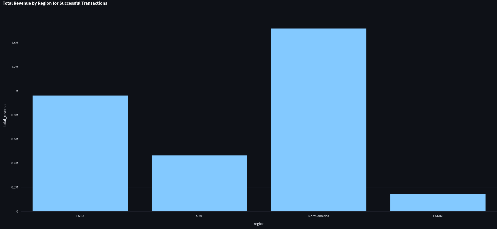
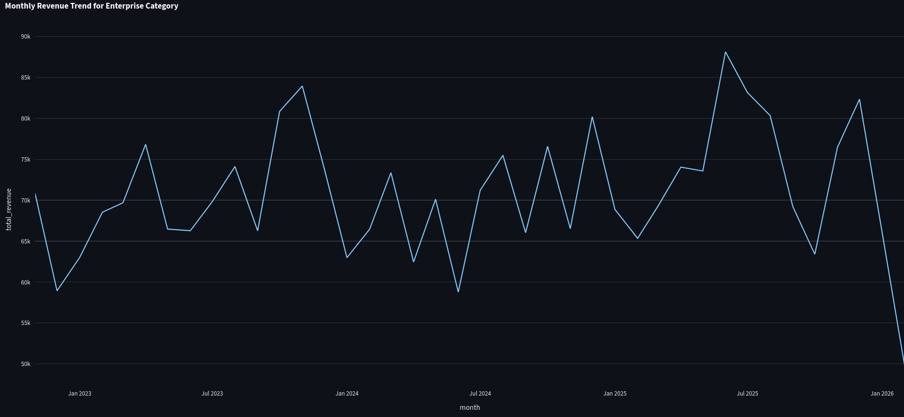

# 🔭 DataLens: ReAct Lakehouse Agent


DataLens is an autonomous analytics agent built on the **ReAct (Reasoning and Acting)** framework. It bridges the gap between a local DuckDB Lakehouse and a dynamic Python/Plotly Sandbox, allowing users to perform complex data extraction, statistical forecasting, and dynamic visualization entirely through natural language.

> Unlike standard text-to-SQL wrappers, DataLens is a **multi-step orchestration engine** capable of self-correcting syntax errors, executing multi-line Python calculations on extracted data, and preventing LLM context-window exhaustion.

---

## 🚀 The Agent in Action

The agent doesn't just write queries — it chains tools together to solve multi-step business problems and visualizes results dynamically.

### Example 1: Regional Revenue Breakdown

**User Prompt:**
> "Show me a bar chart of our total revenue broken down by region for all successful transactions"

**Agent Chain of Thought:**

1. **[Thought]** Needs to query DuckDB, aggregate revenue by region, and ensure case-insensitivity for the `successful` status.
2. **[Tool: `execute_duckdb_query`]** Executes:
   ```sql
   SELECT region, COALESCE(SUM(amount), 0) AS total_revenue
   FROM transactions
   WHERE LOWER(status) = 'successful'
   GROUP BY region
   ```
3. **[Observation]** Retrieves aggregated JSON: EMEA, APAC, North America, and LATAM totals.
4. **[Tool: `generate_chart`]** Formats the JSON payload and routes it to the Plotly rendering engine.



---

### Example 2: Enterprise Monthly Trends

**User Prompt:**
> "Plot the monthly revenue trend for our 'Enterprise' category as a line chart."

**Agent Chain of Thought:**

1. **[Thought]** Needs to aggregate revenue by month specifically for the `Enterprise` category using `DATE_TRUNC`.
2. **[Tool: `execute_duckdb_query`]** Executes:
   ```sql
   SELECT DATE_TRUNC('month', transaction_date) AS month,
          COALESCE(SUM(amount), 0) AS total_revenue
   FROM transactions
   WHERE LOWER(category) = 'enterprise'
   GROUP BY month
   ORDER BY month;
   ```
3. **[Observation]** Extracts 3+ years of time-series data.
4. **[Tool: `generate_chart`]** Configures the x-axis to the month interval and maps the revenue trend as a line chart.



---

## 🧠 System Architecture

| Layer | Technology |
|---|---|
| **Orchestrator** | LangChain (ReAct Agent) + Azure OpenAI (GPT-4o) |
| **Compute / Storage** | DuckDB Lakehouse |
| **Frontend** | Streamlit + Plotly |
| **Environment** | Python 3.12 managed by `uv` |

## 📂 Repository Structure

```text
datalens/
├── .github/workflows/
│   └── ci.yml             # GitHub Actions: Automated linting & build tests
├── assets/                # Documentation assets (Architecture diagrams & screenshots)
│   ├── 1.png              # Regional revenue breakdown demo
│   └── 2.png              # Enterprise monthly trend demo
├── agent_tools.py          # Core ReAct Tools: DuckDB, Python REPL, & Plotly
├── app.py                  # Streamlit: The Agentic UI Layer
├── build_lakehouse.py      # Data Engineering: Lakehouse schema & ETL logic
├── run_agent.py            # CLI: Headless orchestrator for local testing
├── seed_db.py              # Mock Data: 1,200-day synthetic transaction generator
├── pyproject.toml          # uv: Deterministic project metadata & dependencies
└── uv.lock                 # uv: Fully resolved dependency lockfile
```
---

## 🛠️ Key Engineering Innovations

### 1. Autonomous Self-Healing SQL

LLMs frequently hallucinate schema names or stumble over database-specific syntax. The `execute_duckdb_query` tool feeds **DuckDB Parser Errors** and **Catalog Errors** directly back into the agent's observation loop. If the agent queries an invalid column or uses the wrong casing, it autonomously queries `information_schema`, corrects its logic, and executes successfully on the next turn.

### 2. The Context Window "Circuit Breaker"

A common failure state for LLM data agents is querying an entire table, returning 50,000 rows of JSON, and permanently hanging the application. DataLens implements a **hard physical limit** at the database connection layer (`fetchmany(101)`). If a query returns >100 rows, the tool intercepts the payload and instructs the LLM to rewrite the query using proper SQL aggregations (`SUM`, `AVG`, `DATE_TRUNC`).

### 3. Safe Multi-Line String Parsing

LLMs wrap arguments in unpredictable quoting formats (`"""`, `'''`, `"`, `'`). The agent's custom parsing engine intelligently strips multi-line and outer quotes without destroying internal SQL strings or Python string literals, ensuring complex `WHERE` clauses execute natively without parser errors.

---

## 💻 Getting Started

### Prerequisites
- Python 3.12+
- [uv](https://docs.astral.sh/uv/) installed globally (`curl -LsSf https://astral.sh/uv/install.sh | sh`)
### 1. Clone & Setup

```bash
git clone https://github.com/jrbickelh/enterprise-datalens.git
cd enterprise-datalens

# Sync dependencies and create the virtual environment
uv sync
```

### 2. Environment Variables

Copy the example environment file and add your Azure OpenAI credentials.

```bash
cp .env.example .env
```

### 3. Seed the Lakehouse

Generate the local DuckDB database populated with **1,200 days** of synthetic enterprise transaction data.

```bash
uv run python seed_db.py
```

### 4. Launch the App

*To run the headless CLI orchestrator for terminal-based debugging:*
```bash
uv run python run_agent.py
```

Run the interactive Streamlit UI:

```bash
uv run streamlit run app.py
```

---

## 🧪 Continuous Integration

The repository is fully equipped with a **GitHub Actions** pipeline (`datalens-ci.yml`) that utilizes `uv` to instantly build the environment, verify the lockfile, and run **Ruff** linting to enforce PEP-8 standards and catch logical errors before deployment.

---
## 👨‍💻 Author
**Jordan Bickelhaupt**

Data Scientist & Engineer
* [Connect on LinkedIn](https://www.linkedin.com/in/jrbickelh/)
* [View Portfolio](https://github.com/jrbickelh)
