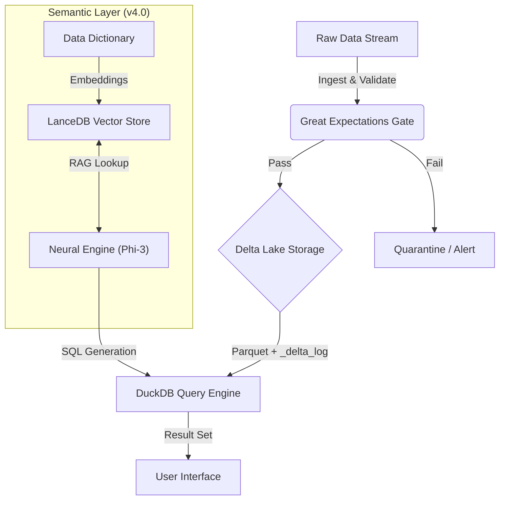

# Enterprise DataLens v4.0 | Neural Temporal Lakehouse


**Enterprise DataLens** is a **local-first Lakehouse engine** showcasing modern data engineering patterns by unifying **ACID storage, time travel, data quality enforcement, and semantic vector search** behind a single query interface.

Built to simulate a high-scale financial analytics platform, DataLens enables:

- Natural language queries translated into SQL  
- Historical “time travel” queries across dataset versions  
- Automated data validation at ingestion  
- Fast, in-process analytical querying  

---
### Scenario 1: The "Fuzzy" Business Question

**You ask:**
> *"How much money is pending right now?"*

**The Engine (v4.0) reacts:**

1. **Semantic Search:** Scans the Data Dictionary and realizes "money" maps to the `amount` column and "pending" is a value in the `status` column.
2. **Neural Translation:** The local LLM (Phi-3) writes the optimized SQL.
3. **Execution:** DuckDB runs the query against the Delta Lake.

**The Output:**

```sql
-- Generated automatically by Neural Engine
SELECT COALESCE(SUM(amount), 0) as total_pending 
FROM transactions 
WHERE status ILIKE 'pending';
```

```
+-------------------+
|   total_pending   |
+-------------------+
|    $42,530.00     |
+-------------------+
```

---

### Scenario 2: Time Travel (Audit & Compliance)

**You ask:**
> *"What did the transaction count look like yesterday (Version 0)?"*

**The Engine reacts:** It recognizes the intent to query historical data without needing to restore a backup.

**The Output:**

```sql
-- Time Travel Query
SELECT count(*) FROM transactions VERSION AS OF 0;
```

```
+-------+
| count |
+-------+
|  500  |  <-- Result from the past (Current count is 505)
+-------+
```

---

## 🏗 Architecture

Enterprise DataLens follows a **Medallion Architecture** compressed into a high-performance local execution model.



---

## ✨ Key Capabilities

| Feature            | Technology           | Description |
|--------------------|----------------------|-------------|
| Temporal Querying  | delta-rs             | Query historical versions of data with zero duplication (Time Travel). |
| Semantic Search    | LanceDB              | Vector-based schema discovery enabling fuzzy, natural-language queries. |
| Schema Enforcement | Delta Lake           | Strict type-checking and metadata validation to prevent data corruption. |
| Data Quality       | Great Expectations   | Automated validation gates preventing bad data from entering the lake. |
| Compute Engine     | DuckDB               | In-process OLAP engine delivering sub-second analytics on Parquet. |
| CI/CD Pipeline     | GitHub Actions       | Automated lakehouse builds and end-to-end query tests on every push. |
---

## 🚀 Getting Started

This project uses **uv** for fast dependency resolution and deterministic environments.

### Prerequisites

- **Python 3.11+**
- **uv** (recommended) or **pip**
- **[Ollama](https://ollama.com/)** (running `phi3` or `llama3`) for local LLM inference

---

## Installation

Clone the repository:

```bash
git clone https://github.com/jrbickelh/enterprise-datalens.git
cd enterprise-datalens
```

Sync the environment:

```bash
uv sync --frozen --no-install-project --all-extras
```

Build the Lakehouse and Semantic Index:

```bash
# Generate synthetic data, validate it, and build the Delta table
uv run python build_lakehouse.py

# Index schema metadata into the vector store
uv run python semantic_indexer.py
```

---

## 🧠 Usage

### Interactive Mode (Neural Shell)

Launch the conversational query engine:

```bash
uv run python datalens_engine.py
```

Example prompts:

- `Show me the total active transactions`
- `What was the count of records for version 0?`
- `show history`

---

### Headless Mode (CI / Automation)

Run a single query and exit—ideal for automated reporting or tests:

```bash
uv run python datalens_engine.py --sql "SELECT COUNT(*) FROM transactions"
```

---

## 🛡 Quality Assurance

Enterprise DataLens follows strict **DataOps and Lakehouse best practices**:

- **Validation Gate**  
  Every write is validated against  
  `gx/expectations/banking_quality_suite.json`.

- **Continuous Integration**  
  The CI pipeline builds the environment from scratch, generates fresh data,
  and runs an end-to-end smoke test on every commit.

- **Deterministic Builds**  
  `uv.lock` guarantees identical dependency resolution across local development
  and CI environments.

---

## 📂 Project Structure

```text
├── .github/workflows/   # CI/CD automation (GitHub Actions)
├── gx/                  # Great Expectations data quality suites
├── lancedb/             # (Ignored) local vector store
├── lakehouse/           # (Ignored) Delta Lake storage (Parquet + logs)
├── build_lakehouse.py   # Data generator & ingestion pipeline
├── datalens_engine.py   # Main query engine & CLI
├── semantic_indexer.py  # Vector embedding & indexing
├── gx_config.py         # Data quality configuration
└── uv.lock              # Immutable dependency manifest
```

---

## 📌 Summary

**Enterprise DataLens v4.0** demonstrates how modern Lakehouse concepts—**ACID storage, time travel, semantic querying, and automated data quality**—can be combined into a **single, local-first analytics engine** suitable for enterprise-scale design discussions, experimentation, and CI-driven validation.


