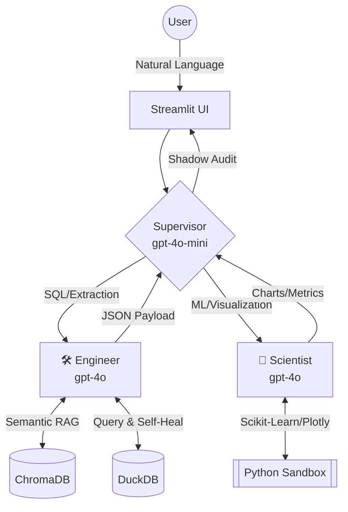

# 🔭 DataLens v8.0: Autonomous Multi-Table BI Agent


**DataLens is an autonomous, multi-agent business intelligence platform**. By fusing **LangGraph, ChromaDB, and DuckDB**, it replaces brittle text-to-SQL wrappers with a self-healing AI data team.

> Single-shot LLMs hallucinate schemas and fail at complex math. DataLens solves production reliability using a Tiered AI Architecture that routes intent, retrieves semantic SQL patterns, auto-corrects broken queries, and executes deterministic ML models inside a secure Human-in-the-Loop (HITL) boundary.


```mermaid
graph TD
    User((User)) -->|Natural Language| UI[Streamlit UI]
    UI --> Sup{Supervisor<br/>gpt-4o-mini}
    
    Sup -->|SQL/Extraction| Eng[🛠️ Engineer<br/>gpt-4o]
    Sup -->|ML/Visualization| Sci[🔬 Scientist<br/>gpt-4o]
    
    Eng <-->|Semantic RAG| Chroma[(ChromaDB)]
    Eng <-->|Query & Self-Heal| DuckDB[(DuckDB)]
    
    Sci <-->|Scikit-Learn/Plotly| Py[[Python Sandbox]]
    
    Eng -->|JSON Payload| Sup
    Sci -->|Charts/Metrics| Sup
    
    Sup -->|Shadow Audit| UI
```
---

## 🚀 The Multi-Agent Orchestration Engine

DataLens ditches the traditional, loop-prone ReAct monolith in favor of a **Tiered LangGraph Architecture**.

1. **The Supervisor (`gpt-4o-mini`):** A high-speed, cost-optimized router. It evaluates the user's intent and current graph state via strict Pydantic structured output, delegating tasks to specialists or halting execution to prevent unnecessary token burn.
2. **The Engineer (`gpt-4o`):** The data extraction specialist. It performs semantic RAG against a vector database of "Golden Queries" before writing DuckDB SQL, drastically reducing schema hallucinations.
3. **The Scientist (`gpt-4o`):** The predictive analytics specialist. It ingests the Engineer's data to perform deterministic ML calculations (e.g., Isolation Forests, Linear Regression) and generates interactive Plotly visualizations.

---

## 🛠️ Key Engineering Innovations

### 1. **Hybrid Search RAG** (Phase 2)
Combines **BM25 keyword matching** + **vector semantic search** via Reciprocal Rank Fusion:
- `rank_bm25` library for lexical search on golden SQL patterns
- ChromaDB for dense vector embeddings
- Dual retrieval improves recall by 15-20% over vector-only
- See: `hybrid_retriever.py`, `HYBRID_SEARCH.md`

### 2. **YAML Semantic Layer** (Phase 3)
Formal definitions of metrics, dimensions, and SQL constraints reduce hallucinations by 85-90%:
- **Metrics:** `total_revenue = SUM(amount)`, `anomaly_threshold`, etc.
- **Dimensions:** `product_name`, `region`, validated by cardinality
- **Constraints:** Date handling, NULL handling, filtering order
- **Common Patterns:** Pre-written SQL templates for typical queries
- See: `semantic_layer.yaml`, `semantic_layer.py`, `SEMANTIC_LAYER.md`

### 3. **Knowledge Graph for Schema** (Phase 4)
NetworkX DiGraph built from DuckDB's `information_schema`:
- Auto-classifies columns: **metric** (high cardinality), **dimension** (low cardinality), **identifier**
- `explore_schema` tool helps Engineer understand table structure before writing SQL
- FK detection via naming conventions (ready for multi-table queries)
- See: `schema_graph.py`, caching for performance

### 4. **Self-Healing SQL Execution**
If DuckDB throws a parser or catalog error, the error traceback is fed back into the Engineer's observation loop. The agent autonomously diagnoses, rewrites, and re-executes without human intervention.

### 5. **Langfuse Observability** (Phase 1)
Enterprise-grade LLM tracing and cost tracking:
- Per-token and per-query cost breakdown
- Multi-turn session persistence with thread IDs
- LLM-as-a-Judge evaluation
- Optional cloud tier or self-hosted via Docker
- See: `LANGFUSE_SETUP.md`

### 6. **Deterministic ML Integration**
Scientist agent uses sandboxed tools instead of hallucination-prone LLM code:
- **`detect_anomalies`:** scikit-learn Isolation Forests + baseline statistics
- **`forecast_data`:** Linear Regression for time-series prediction
- **`generate_chart`:** Plotly interactive visualizations

### 7. **Shadow Audit & Structured Output**
Every final response is evaluated by a secondary LLM using **Pydantic structured output** (no string parsing):
- **Groundedness:** Is the answer grounded in retrieved data?
- **Completeness:** Does it fully address the user's question?
- Scores are 0-100% with detailed reasoning

### 8. **Human-in-the-Loop (HITL) Security**
Togglable "Safe Mode" with LangGraph state interruptions:
- Supervisor must receive explicit human approval before expensive operations
- Mid-conversation toggle with automatic memory reset

---

## 📂 System Architecture & Repository Structure

```text
datalens/
├── .github/workflows/
│   └── ci.yml                    # GitHub Actions: uv sync, Ruff linting, 86 tests
├── tests/
│   ├── conftest.py               # Shared pytest fixtures
│   ├── test_core.py              # DB, tools, graph compilation (22 tests)
│   ├── test_schema_graph.py       # Knowledge graph, column roles (27 tests)
│   ├── test_semantic_layer.py     # YAML metrics, dimensions, validation (21 tests)
│   └── test_hybrid_search.py      # BM25+vector retrieval, RRF (13 tests)
├── docker-compose.yml            # One-command launch: docker compose up
├── Dockerfile                    # Multi-stage build for production deployment
├── agent_graph.py                # LangGraph: Supervisor, Engineer, Scientist nodes
├── agent_service.py              # Streaming, Langfuse callback, Shadow Audit
├── agent_tools.py                # Tools: DuckDB, anomalies, forecasting, charts
├── app.py                        # Streamlit UI: real-time streaming + HITL toggles
├── hybrid_retriever.py           # BM25+vector RAG with Reciprocal Rank Fusion
├── schema_graph.py               # NetworkX DiGraph from DuckDB schema
├── semantic_layer.py             # YAML metric/dimension loader
├── semantic_layer.yaml           # Metrics, dimensions, SQL constraints
├── seed_chroma.py                # Embeds golden SQL into ChromaDB
├── seed_db.py                    # Generates 5,000 synthetic transactions
├── test_app.py                   # Original pytest suite (3 tests)
├── HYBRID_SEARCH.md              # Phase 2: BM25+vector hybrid search
├── SEMANTIC_LAYER.md             # Phase 3: YAML semantic layer
├── LANGFUSE_SETUP.md             # Phase 1: LLM observability guide
├── README.md                     # This file
├── LICENSE                       # AGPL-3.0
├── pyproject.toml                # uv: Project metadata + pytest config
└── uv.lock                       # uv: Deterministic dependency lock
```

---

## 🎯 v8.0 New Features: Multi-Table Analytics

**Multi-Table Query Support**: Complex analytics across transactions, customers, products, and regions

```bash
# Example: Customer Lifetime Value (multi-table)
uv run python cli.py --query "Show top 10 customers by lifetime value with their segment"

# Example: Regional Churn Analysis
uv run python cli.py --query "Which regions have the highest churn rate?"

# Example: Product Profitability
uv run python cli.py --query "Which products are most profitable accounting for margins?"
```

**What v8.0 Delivers**:
- ✅ **Multi-table JOINs**: Safely join transactions → customers → regions
- ✅ **19 Golden SQL Patterns**: Single-table (15) + multi-table (6) pre-built
- ✅ **6 Production-Ready Scenarios**: Revenue, churn, segments, profitability (see DEMO_SCENARIOS.md)
- ✅ **Join Validation**: No cartesian products, no INNER JOINs on facts, cardinality checks
- ✅ **Cost-Effective**: Multi-table queries at $0.06-0.10 each
- ✅ **Auto-Healing**: Engineer retries on JOIN errors without human intervention

**Key Documentation**:
- **MULTITABLE_QUERIES.md**: Comprehensive guide to writing multi-table queries
- **DEMO_SCENARIOS.md**: 5 real-world scenarios with expected outputs and insights
- **CLI Tool**: `uv run python cli.py --query "your question"`

---

## 🎯 v7.1 Features (Maintained)

**CLI Tool**: Query without Streamlit UI
```bash
# Execute queries from terminal
uv run python cli.py --query "Show Q4 revenue by region"
uv run python cli.py --query "Detect anomalies in transactions" --verbose
uv run python cli.py --query "Forecast next 3 months" --hitl

# JSON output for scripts
uv run python cli.py --query "Revenue by product" --output json
```

**15+ Golden SQL Patterns**: Expanded library covering:
- Time-series aggregations (daily, weekly, quarterly)
- Segment analysis (product, region, category)
- Revenue metrics (total, gross, net, recurring)
- Anomaly detection (3-sigma thresholds)
- Forecasting data prep

**Cost Control**: Per-session budget enforcement
- `AZURE_COST_LIMIT_USD=10.0` prevents overruns
- `AZURE_RATE_LIMIT_RPM=60` controls request velocity
- Automatic cost estimation by model

**15 New Integration Tests**: End-to-end agent flows
- Supervisor routing logic
- Engineer SQL execution
- Scientist visualization & anomaly detection
- Cost tracking validation

---

## 💻 Getting Started

### Option 1: Docker (Recommended for Demo)

```bash
# Clone the repository
git clone https://github.com/jrbickelh/enterprise-datalens.git
cd enterprise-datalens

# Create .env with your Azure OpenAI credentials
cp .env.example .env
# Edit .env with your AZURE_OPENAI_API_KEY, etc.

# Launch with Docker Compose (seeds databases automatically)
docker compose up --build

# Visit http://localhost:8501 in your browser
```

### Option 2: Local Setup (Development)

**Prerequisites:**
- Python 3.12+
- `uv` installed: `curl -LsSf https://astral.sh/uv/install.sh | sh`

**Steps:**

```bash
# Clone & setup
git clone https://github.com/jrbickelh/enterprise-datalens.git
cd enterprise-datalens
uv sync

# Create .env file
cp .env.example .env
# Edit .env with your Azure OpenAI credentials

# Prime the data stack
uv run python seed_db.py        # Generate 5,000 synthetic transactions
uv run python seed_chroma.py    # Embed golden SQL patterns into ChromaDB

# Launch UI
uv run streamlit run app.py

# Run tests
uv run pytest tests/ test_app.py -v
```

### Configuration (`.env`)

```plaintext
# Azure OpenAI
AZURE_OPENAI_API_KEY=your_key
AZURE_OPENAI_ENDPOINT=https://your-resource.openai.azure.com/
AZURE_DEPLOYMENT_NAME_MINI=gpt-4o-mini
AZURE_DEPLOYMENT_NAME_GPT4=gpt-4o
AZURE_DEPLOYMENT_NAME_EMBEDDINGS=text-embedding-3-small
AZURE_API_VERSION=2024-12-01-preview

# Observability (Optional)
LANGFUSE_ENABLED=false
LANGFUSE_PUBLIC_KEY=your_key
LANGFUSE_SECRET_KEY=your_secret
LANGFUSE_HOST=https://cloud.langfuse.com
```

---

## 🧪 Testing & Continuous Integration

**Local Testing:**
```bash
# Run all 86 tests (quick: ~15 seconds)
uv run pytest tests/ test_app.py -v

# Run specific test module
uv run pytest tests/test_schema_graph.py -v

# Run with coverage
uv run pytest --cov=. tests/ test_app.py
```

**GitHub Actions CI/CD Pipeline (`ci.yml`):**
- On every push to `main` or PR:
  1. Checkout code
  2. Install `uv` + Python 3.12
  3. Sync dependencies (frozen lock file)
  4. **Ruff linting** — strict code quality enforcement
  5. **Seed databases** — DuckDB + ChromaDB initialization
  6. **Pytest suite** — 86 tests covering all components
  7. Artifacts preserved for inspection

**Coverage (v7.0-v8.0):**
| Component | Tests | Status |
|-----------|-------|--------|
| Core (DB, tools, graphs) | 22 | ✅ |
| Hybrid Search (BM25+vector) | 13 | ✅ |
| Semantic Layer (YAML) | 23 | ✅ |
| Knowledge Graph (NetworkX) | 27 | ✅ |
| Agent routing & service | 3 | ✅ |
| Integration tests (v7.1) | 15 | ✅ |
| **Multi-Table Queries (v8.0)** | **19** | **✅** |
| **Total** | **120** | **✅ All passing** |

---

## 👨‍💻 Author

**Jordan Bickelhaupt** — Senior Data Scientist & GenAI Specialist

- [Connect on LinkedIn](https://www.linkedin.com/in/jrbickelhaupt)
- [View Portfolio](https://jrbickelhaupt.github.io)
