# 🔭 DataLens: Autonomous Multi-Agent BI Platform


**DataLens is an autonomous, multi-agent business intelligence platform**. By fusing **LangGraph, ChromaDB, and DuckDB**, it replaces brittle text-to-SQL wrappers with a self-healing AI data team.

> Single-shot LLMs hallucinate schemas and fail at complex math. DataLens solves production reliability using a Tiered AI Architecture that routes intent, retrieves semantic SQL patterns, auto-corrects broken queries, and executes deterministic ML models inside a secure Human-in-the-Loop (HITL) boundary.

```mermaid
graph TD
    User((User)) -->|Natural Language| UI[Streamlit UI]
    UI --> Sup{Supervisor<br/>gpt-4o-mini}
    
    Sup -->|SQL/Extraction| Eng[🛠️ Engineer<br/>gpt-4o]
    Sup -->|ML/Visualization| Sci[🔬 Scientist<br/>gpt-4o]
    
    Eng <-->|Semantic RAG| Chroma[(ChromaDB)]
    Eng <-->|Query & Self-Heal| DuckDB[(DuckDB)]
    
    Sci <-->|Scikit-Learn/Plotly| Py[[Python Sandbox]]
    
    Eng -->|JSON Payload| Sup
    Sci -->|Charts/Metrics| Sup
    
    Sup -->|Shadow Audit| UI
```


---

## 🚀 The Multi-Agent Orchestration Engine

DataLens ditches the traditional, loop-prone ReAct monolith in favor of a **Tiered LangGraph Architecture**.

1. **The Supervisor (`gpt-4o-mini`):** A high-speed, cost-optimized router. It evaluates the user's intent and current graph state via strict Pydantic structured output, delegating tasks to specialists or halting execution to prevent unnecessary token burn.
2. **The Engineer (`gpt-4o`):** The data extraction specialist. It performs semantic RAG against a vector database of "Golden Queries" before writing DuckDB SQL, drastically reducing schema hallucinations.
3. **The Scientist (`gpt-4o`):** The predictive analytics specialist. It ingests the Engineer's data to perform deterministic ML calculations (e.g., Isolation Forests, Linear Regression) and generates interactive Plotly visualizations.

---

## 🛠️ Key Engineering Innovations

### 1. Semantic SQL RAG & Self-Healing Execution

LLMs frequently hallucinate schema logic. DataLens solves this on two fronts:

- **Vector Memory:** The Engineer agent queries a local ChromaDB instance to retrieve verified enterprise SQL patterns before writing code.
- **Autonomous Reflection:** If the DuckDB engine throws a parser or catalog error, the error traceback is fed directly back into the Engineer's observation loop. The agent autonomously diagnoses the issue, rewrites the query, and re-executes without human intervention.

### 2. Predictive ML Integration

Rather than allowing the LLM to write hallucination-prone Python scripts for math, the Scientist agent is equipped with deterministic, sandboxed ML tools:

- **`detect_anomalies`:** Uses `scikit-learn` Isolation Forests to flag outliers, returning baseline statistics (mean/std) so the LLM can narratively explain *why* a data point is anomalous.
- **`forecast_data`:** Applies Linear Regression to time-series data to predict future trends based on historical JSON payloads.

### 3. Enterprise LLMOps & Shadow Auditing

Trust is paramount in BI. Every final response undergoes a programmatic **Shadow Audit** where a secondary LLM evaluates the output against the raw retrieved data, scoring it from 0–100% on **Groundedness** and **Completeness**.

### 4. Human-in-the-Loop (HITL) Security Breakpoints

DataLens features a togglable "Safe Mode" that implements LangGraph state interruptions. When enabled, the Supervisor must receive explicit human approval in the UI before delegating computationally expensive tasks to the GPT-4o worker nodes.

---

## 📂 System Architecture & Repository Structure

```text
datalens/
├── .github/workflows/
│   └── ci.yml             # Automated CI/CD: uv sync, Ruff linting, Pytest suite
├── assets/                # Documentation assets (Demo GIFs & screenshots)
├── agent_graph.py         # LangGraph state definition, routing logic, and nodes
├── agent_service.py       # Graph streaming, event parsing, and LLM Shadow Audit
├── agent_tools.py         # Core Tools: DuckDB execution, ML algorithms, Plotly
├── app.py                 # Streamlit UI: Real-time thought streaming & HITL toggles
├── seed_chroma.py         # RAG Setup: Embeds Golden SQL queries into ChromaDB
├── seed_db.py             # Data Eng: Generates 5,000+ synthetic transactions
├── test_app.py            # Pytest suite & Headless CLI debugging tool
├── pyproject.toml         # uv: Deterministic project metadata
└── uv.lock                # uv: Fully resolved dependency lockfile
```

---

## 💻 Getting Started

### Prerequisites

- Python 3.12+
- `uv` installed globally: `curl -LsSf https://astral.sh/uv/install.sh | sh`

### 1. Clone & Setup

```bash
git clone https://github.com/jrbickelh/enterprise-datalens.git
cd enterprise-datalens

# Sync dependencies seamlessly via uv
uv sync
```

### 2. Environment Configuration

Create a `.env` file in the root directory and map your Azure OpenAI endpoints (or standard OpenAI keys):

```plaintext
AZURE_OPENAI_API_KEY=your_key
AZURE_OPENAI_ENDPOINT=https://your-resource.openai.azure.com/
AZURE_DEPLOYMENT_NAME_MINI=gpt-4o-mini
AZURE_DEPLOYMENT_NAME_GPT4=gpt-4o
AZURE_DEPLOYMENT_NAME_EMBEDDINGS=text-embedding-3-small
```

### 3. Prime the Engines

Build the DuckDB Lakehouse and embed the ChromaDB vector memory:

```bash
uv run python seed_db.py
uv run python seed_chroma.py
```

### 4. Launch the Platform

```bash
# Run the interactive Streamlit UI
uv run streamlit run app.py

# Or run the headless CLI debugger and test suite
uv run pytest test_app.py -v
```

---

## 🧪 Continuous Integration (CI/CD)

The repository is fortified by a rigorous GitHub Actions pipeline (`ci.yml`). On every push, the pipeline utilizes `uv` to instantly build the environment, seeds the vector/relational databases in an isolated Ubuntu container, enforces strict Ruff linting, and executes the Pytest suite to guarantee routing logic integrity.

---

## 👨‍💻 Author

**Jordan Bickelhaupt** — Senior Data Scientist & GenAI Specialist

- [Connect on LinkedIn](https://www.linkedin.com/in/jrbickelhaupt)
- [View Portfolio](https://jrbickelhaupt.github.io)
